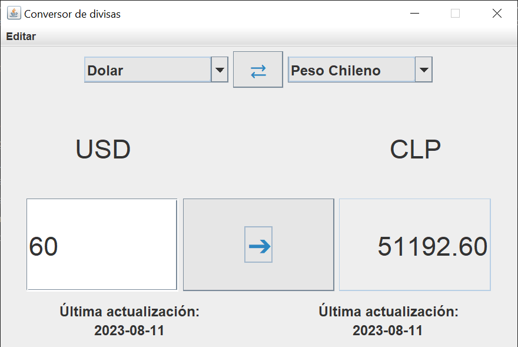
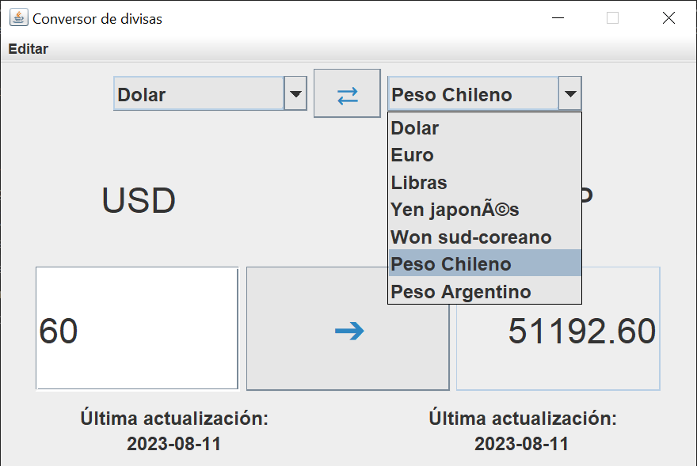
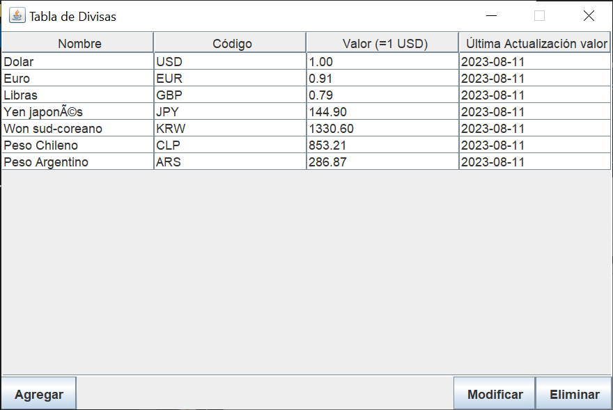

# Conversor de Divisas

## Descripción

Esta es una aplicación de conversor de divisas desarrollada en Java utilizando la biblioteca Java Swing para la interfaz gráfica. La aplicación permite convertir entre diferentes monedas utilizando las tasas de cambio almacenadas localmente en un archivo JSON. Además, ofrece la funcionalidad de agregar, eliminar y modificar las divisas directamente desde la aplicación.

## Características

- Conversión de divisas en tiempo real utilizando tasas de cambio almacenadas localmente.
- Interfaz gráfica intuitiva y de fácil uso desarrollada con Java Swing.
- Funcionalidad para agregar, eliminar y modificar divisas en la lista.
- Almacenamiento de la información de las divisas en un archivo JSON para acceso local.

## Capturas de Pantalla

## Instalación y Uso

1. Clona o descarga este repositorio.
2. Asegúrate de tener Java instalado en tu sistema.
3. Compila y ejecuta la aplicación utilizando tu IDE o herramienta de compilación favorita.
4. Tambien puede usar el archivo .jar ejecutable.

## Contribución

¡Las contribuciones son bienvenidas! Si encuentras algún error, tienes sugerencias o deseas agregar nuevas características, no dudes en crear un issue o enviar un pull request.

## Futuras Mejoras

- Mejorar la apariencia y usabilidad de la interfaz gráfica.
- Añadir la opción de actualizar automáticamente las tasas de cambio desde una fuente en línea.
- Implementar un historial de conversiones realizadas.
- Incorporar más funciones avanzadas de conversión, además de otro tipo de conversores.
